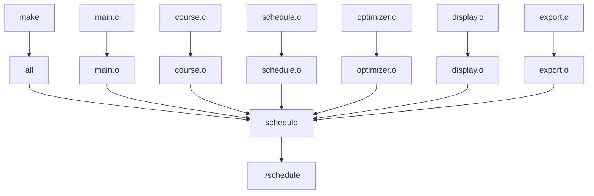
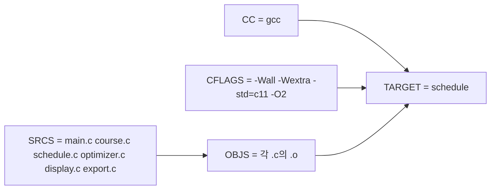

# 빌드 구조

`Makefile`은 여섯 개의 C 파일을 각각 오브젝트 파일로 컴파일한 뒤, 최종 실행 파일 `schedule`로 링크합니다.

```mermaid
flowchart TD
  A["make"] --> B["all"]
  B --> C["schedule"]

  D["main.c"] --> D1["main.o"]
  E["course.c"] --> E1["course.o"]
  F["schedule.c"] --> F1["schedule.o"]
  G["optimizer.c"] --> G1["optimizer.o"]
  H["display.c"] --> H1["display.o"]
  I["export.c"] --> I1["export.o"]

  D1 --> C
  E1 --> C
  F1 --> C
  G1 --> C
  H1 --> C
  I1 --> C

  C --> J["./schedule"]
```

## 컴파일 설정

```mermaid
flowchart LR
  CC["CC = gcc"]
  CFLAGS["CFLAGS = -Wall -Wextra -std=c11 -O2"]
  SRCS["SRCS = main.c course.c schedule.c optimizer.c display.c export.c"]
  OBJS["OBJS = 각 .c의 .o"]
  TARGET["TARGET = schedule"]

  CC --> TARGET
  CFLAGS --> TARGET
  SRCS --> OBJS
  OBJS --> TARGET
```

