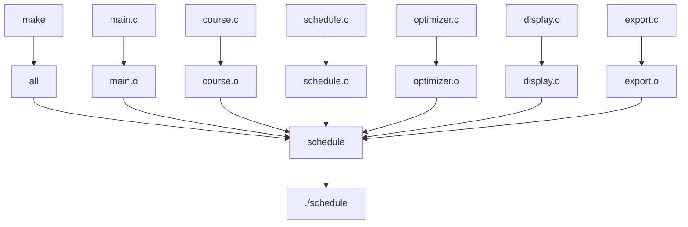
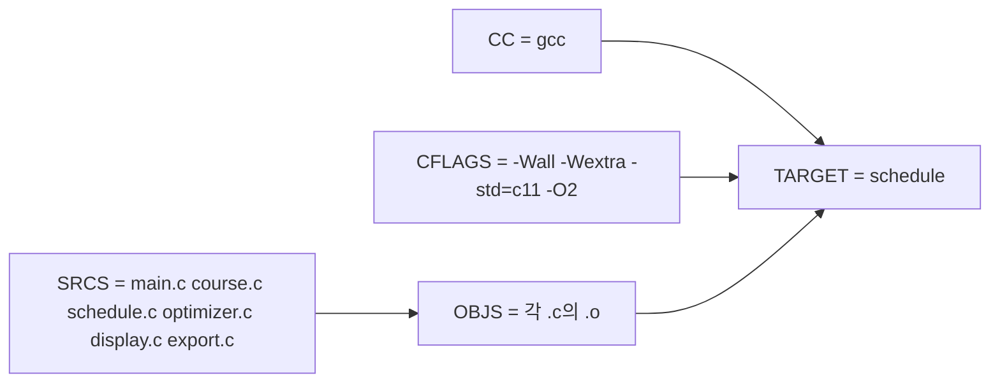
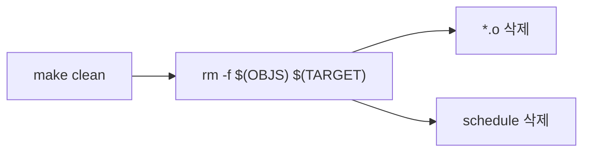
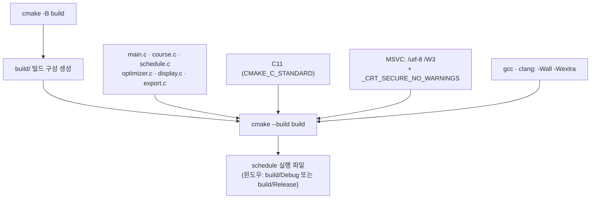

# 빌드 구조

`Makefile`은 여섯 개의 C 파일을 각각 오브젝트 파일로 컴파일한 뒤, 최종 실행 파일 `schedule`로 링크합니다.

## 컴파일 설정

## `clean` 타깃

`make clean`은 빌드 산출물(오브젝트 파일과 실행 파일)을 모두 지웁니다.

## CMake 빌드 (Visual Studio · 크로스 플랫폼)

`Makefile`과 별개로 `CMakeLists.txt`도 같은 여섯 개 소스를 빌드합니다. Visual Studio 2026은
"파일 → 열기 → 폴더"로 자동 구성되고, 명령줄에서는 아래 두 명령으로 빌드합니다.

> 컴파일 플래그 차이: `Makefile`은 `-O2` 최적화를 켜지만, `CMakeLists.txt`에는 별도
> 최적화 플래그가 없어 빌드 타입 기본값을 따릅니다.
