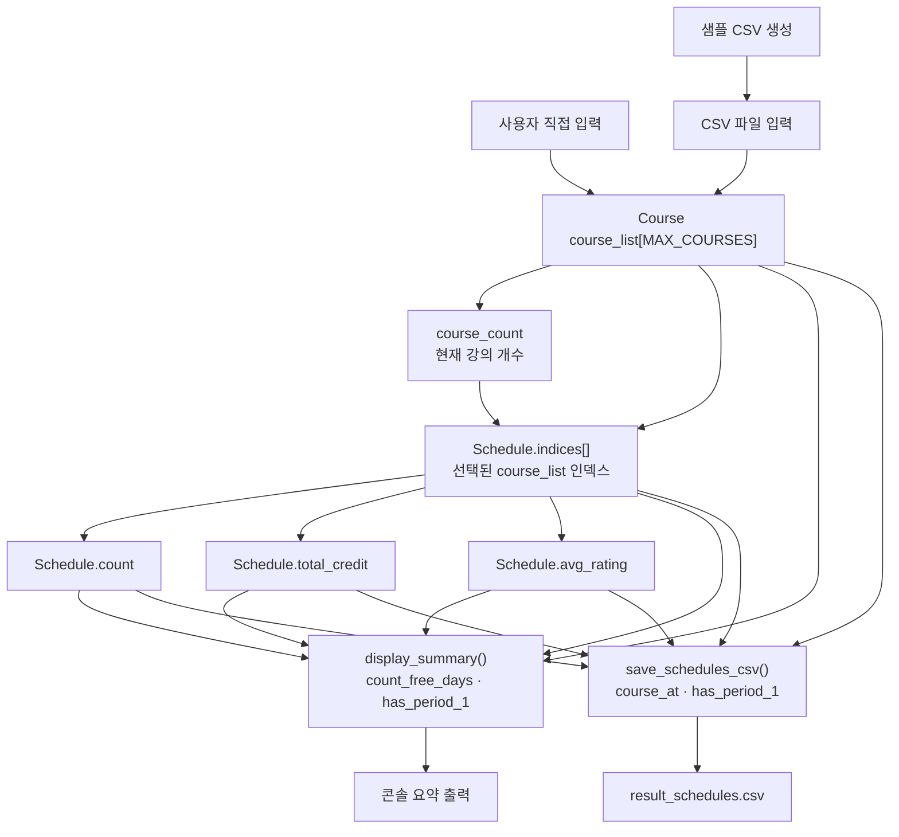
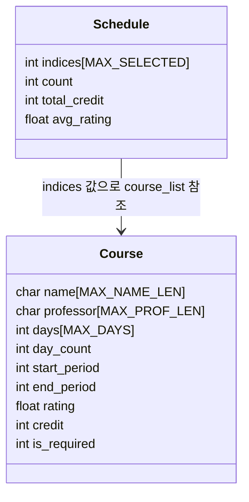
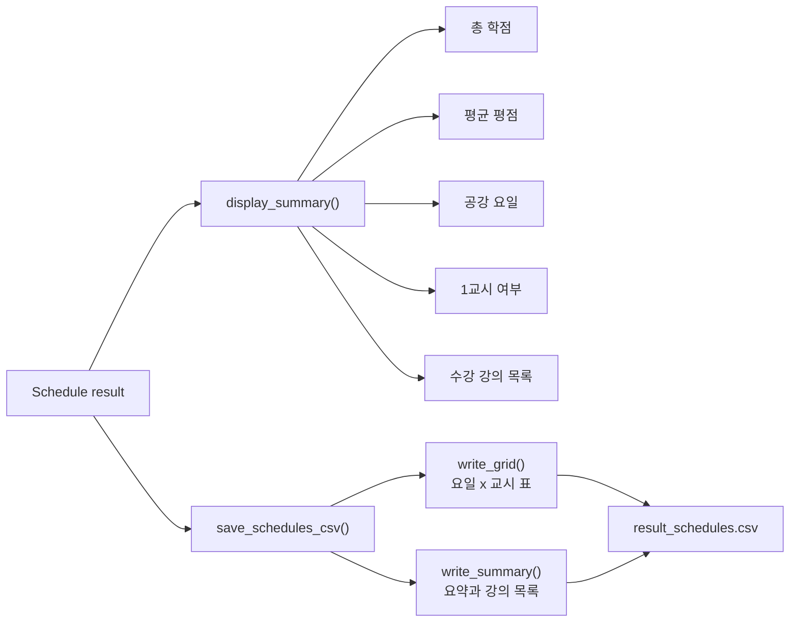

# 데이터와 출력 흐름

강의 데이터는 `Course` 배열에 저장되고, 최적화 결과는 `Schedule` 구조체에 강의 인덱스 목록으로 저장됩니다.

```mermaid
flowchart TD
  A["사용자 직접 입력"] --> C["Course course_list[MAX_COURSES]"]
  B["CSV 파일 입력"] --> C
  D["샘플 CSV 생성"] --> B

  C --> E["course_count<br/>현재 강의 개수"]
  C --> F["Schedule.indices[]<br/>선택된 course_list 인덱스"]
  E --> F

  F --> G["Schedule.count"]
  F --> H["Schedule.total_credit"]
  F --> I["Schedule.avg_rating"]

  G --> J["display_summary()<br/>count_free_days · has_period_1"]
  H --> J
  I --> J

  G --> K["save_schedules_csv()<br/>course_at · has_period_1"]
  H --> K
  I --> K

  %% display·export는 요약값뿐 아니라 indices[]·course_list를 직접 참조함
  C --> J
  C --> K
  F --> J
  F --> K

  J --> L["콘솔 요약 출력"]
  K --> M["result_schedules.csv"]
```

## `Course`와 `Schedule` 관계

```mermaid
classDiagram
  class Course {
    char name[MAX_NAME_LEN]
    char professor[MAX_PROF_LEN]
    int days[MAX_DAYS]
    int day_count
    int start_period
    int end_period
    float rating
    int credit
    int is_required
  }

  class Schedule {
    int indices[MAX_SELECTED]
    int count
    int total_credit
    float avg_rating
  }

  Schedule --> Course : indices 값으로 course_list 참조
```

## 출력 처리

```mermaid
flowchart LR
  S["Schedule result"] --> D["display_summary()"]
  S --> E["save_schedules_csv()"]

  D --> D1["총 학점"]
  D --> D2["평균 평점"]
  D --> D3["공강 요일"]
  D --> D4["1교시 여부"]
  D --> D5["수강 강의 목록"]

  E --> E1["write_grid()<br/>요일 x 교시 표"]
  E --> E2["write_summary()<br/>요약과 강의 목록"]
  E1 --> F["result_schedules.csv"]
  E2 --> F
```
