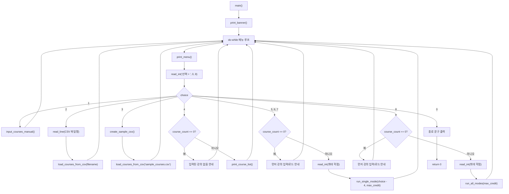

# `main()` 메뉴 흐름

`main()`은 프로그램 시작 후 메뉴를 반복해서 보여 주고, 선택 번호에 따라 입력, 조회, 최적화, 종료를 실행합니다.

## 선택 번호별 역할

- `1`: 콘솔에서 강의를 직접 입력합니다.
- `2`: 사용자가 지정한 CSV 파일에서 강의를 불러옵니다.
- `3`: 샘플 CSV를 만든 뒤 바로 불러옵니다.
- `4`: 현재 강의 목록을 출력합니다.
- `5`-`7`: 모드 하나를 선택해 시간표를 생성합니다.
- `8`: 세 가지 모드를 모두 생성합니다.
- `0`: 프로그램을 종료합니다.
