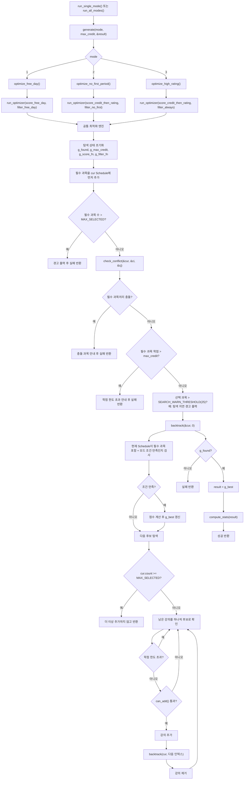
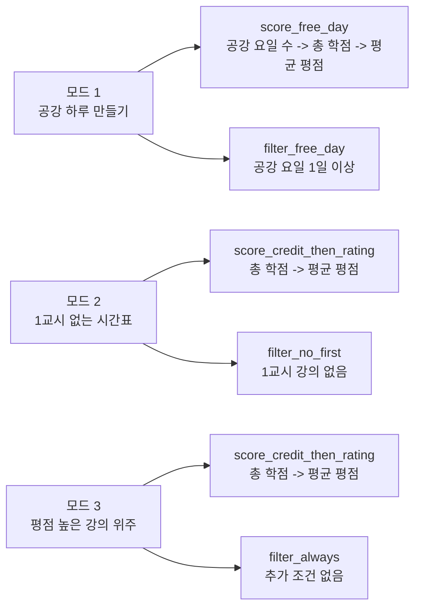

# 최적화 흐름

세 가지 모드는 모두 같은 최적화 엔진인 `run_optimizer()`를 사용합니다. 차이는 점수 함수와 필터 함수입니다.

```mermaid
flowchart TD
  A["run_single_mode() 또는 run_all_modes()"] --> B["generate(mode, max_credit, &result)"]
  B --> C{"mode"}

  C -->|1| D["optimize_free_day()"]
  C -->|2| E["optimize_no_first_period()"]
  C -->|3| F["optimize_high_rating()"]

  D --> G["run_optimizer(score_free_day, filter_free_day)"]
  E --> H["run_optimizer(score_credit_then_rating, filter_no_first)"]
  F --> I["run_optimizer(score_credit_then_rating, filter_always)"]

  G --> J["공통 최적화 엔진"]
  H --> J
  I --> J

  J --> K["탐색 상태 초기화<br/>g_found, g_max_credit, g_score_fn, g_filter_fn"]
  K --> L["필수 과목을 cur Schedule에 먼저 추가"]
  L --> M{"필수 과목 수 > MAX_SELECTED?"}
  M -->|예| N["경고 출력 후 실패 반환"]
  M -->|아니오| O["check_conflict(&cur, &ci, &cj)"]
  O --> P{"필수 과목끼리 충돌?"}
  P -->|예| Q["충돌 과목 안내 후 실패 반환"]
  P -->|아니오| R{"필수 과목 학점 > max_credit?"}
  R -->|예| S["학점 한도 초과 안내 후 실패 반환"]
  R -->|아니오| RW["선택 과목 > SEARCH_WARN_THRESHOLD(25)?<br/>예: 탐색 지연 경고 출력"]
  RW --> T["backtrack(&cur, 0)"]

  T --> U["현재 Schedule이 필수 과목 포함 + 모드 조건 만족인지 검사"]
  U --> V{"조건 만족?"}
  V -->|예| W["점수 계산 후 g_best 갱신"]
  V -->|아니오| X["다음 후보 탐색"]
  W --> X

  X --> Y{"cur.count >= MAX_SELECTED?"}
  Y -->|예| Z["더 이상 추가하지 않고 반환"]
  Y -->|아니오| AA["남은 강의를 하나씩 후보로 확인"]
  AA --> AB{"학점 한도 초과?"}
  AB -->|예| AA
  AB -->|아니오| AC{"can_add() 통과?"}
  AC -->|아니오| AA
  AC -->|예| AD["강의 추가"]
  AD --> AE["backtrack(cur, 다음 인덱스)"]
  AE --> AF["강의 제거"]
  AF --> AA

  T --> AG{"g_found?"}
  AG -->|아니오| AH["실패 반환"]
  AG -->|예| AI["result = g_best"]
  AI --> AJ["compute_stats(result)"]
  AJ --> AK["성공 반환"]
```

## 모드별 기준

```mermaid
flowchart LR
  M1["모드 1<br/>공강 하루 만들기"]
  M2["모드 2<br/>1교시 없는 시간표"]
  M3["모드 3<br/>평점 높은 강의 위주"]

  M1 --> S1["score_free_day<br/>공강 요일 수 -> 총 학점 -> 평균 평점"]
  M1 --> F1["filter_free_day<br/>공강 요일 1일 이상"]

  M2 --> S2["score_credit_then_rating<br/>총 학점 -> 평균 평점"]
  M2 --> F2["filter_no_first<br/>1교시 강의 없음"]

  M3 --> S3["score_credit_then_rating<br/>총 학점 -> 평균 평점"]
  M3 --> F3["filter_always<br/>추가 조건 없음"]
```
