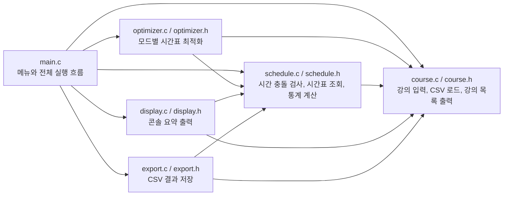

# 전체 모듈 구조

프로젝트는 `main.c`가 실행 흐름을 잡고, 나머지 모듈이 입력, 검증, 최적화, 출력, 저장 역할을 나눠 맡는 구조입니다.

## 핵심 연결

- `main.c`는 사용자 선택을 받아 각 기능 모듈을 호출합니다.
- `course.c`는 전역 `course_list`와 `course_count`를 관리합니다.
- `optimizer.c`는 `Schedule`을 만들고, `schedule.c`의 검사 함수를 사용합니다.
- `display.c`와 `export.c`는 만들어진 `Schedule`을 읽어 화면과 CSV로 표현합니다.

